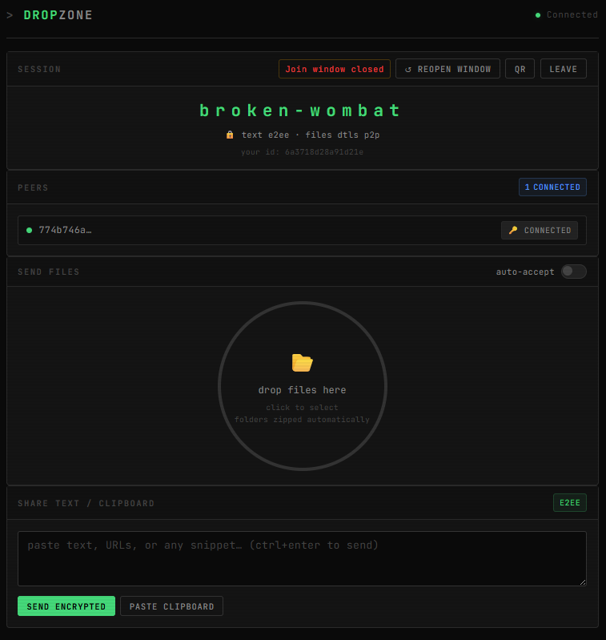

# DropZone




Browser-based peer-to-peer file transfer and encrypted text sharing. Files travel directly between browsers over WebRTC — the server only brokers the connection. Text messages are end-to-end encrypted with AES-256-GCM and never leave the browser as plaintext.

---

## What it does

- **Files go peer-to-peer.** Once two peers connect, the server is not involved in the transfer. Files are sent over a DTLS-encrypted WebRTC data channel.
- **Server relay fallback.** If a direct WebRTC connection cannot be established (e.g. strict NAT), file chunks are relayed through the server as a fallback.
- **Text is end-to-end encrypted.** Messages are encrypted in the browser with AES-256-GCM before being relayed. The server sees only opaque ciphertext.
- **Passphrase-derived session key.** All peers in a session enter the same passphrase. The session key is derived locally via PBKDF2 + HKDF and is never transmitted.
- **No accounts, no storage.** Sessions are ephemeral and exist only in memory. Nothing is written to disk.
- **Folders are zipped automatically** before transfer.

---

## Requirements

- Python 3.11+
- `aiohttp`

```
pip install aiohttp
```

For self-signed TLS certificate generation (recommended):

```
pip install cryptography
```

---

## Running the server

```
python3 server.py
```

The server starts on `https://0.0.0.0:8080` by default. On first run it generates a self-signed TLS certificate (`filedrop-cert.pem` / `filedrop-key.pem`) in the same directory.

Open `https://<your-host>:8080` in a browser. Accept the self-signed certificate warning, or use a trusted certificate (see below).

### Options

| Flag | Default | Description |
|---|---|---|
| `--host` | `0.0.0.0` | Bind address |
| `--port` | `8080` | TCP port |
| `--join-window` | `60` | Seconds the join window stays open after a session is created |
| `--session-ttl` | `3600` | Seconds of inactivity before a session expires |
| `--singleplayer` | off | Once the join window closes, block all IPs that did not join from accessing the server. The page remains open to everyone while a join window is active (including reopened windows). |
| `--ssl-cert` | auto-generated | Path to a PEM certificate file |
| `--ssl-key` | auto-generated | Path to a PEM private key file (required with `--ssl-cert`) |
| `--no-ssl` | — | Disable TLS (Web Crypto API will not work in browsers over plain HTTP) |

### Examples

```
# Different port
python3 server.py --port 443

# Longer join window
python3 server.py --join-window 300

# Shorter session timeout (10 minutes)
python3 server.py --session-ttl 600

# Private session — only participants from the join window can access the server
python3 server.py --singleplayer

# Use an existing certificate (e.g. from Let's Encrypt)
python3 server.py --ssl-cert /etc/letsencrypt/live/example.com/fullchain.pem \
                  --ssl-key  /etc/letsencrypt/live/example.com/privkey.pem
```

### Environment variables

All options can also be set in a `.env` file in the same directory as `server.py`, or as environment variables. CLI flags take precedence.

| Variable | Default | Description |
|---|---|---|
| `HOST` | `0.0.0.0` | Bind address |
| `PORT` | `8080` | TCP port |
| `SESSION_TTL` | `3600` | Seconds of inactivity before a session is removed |
| `JOIN_WINDOW` | `60` | Seconds the join window stays open |
| `TURN_URL` | — | TURN server URL (e.g. `turns:example.com:5349`) |
| `TURN_SECRET` | — | TURN static auth secret |
| `TURN_REALM` | — | TURN realm |
| `TRUSTED_PROXY` | — | Set to `1` if running behind a reverse proxy to trust `X-Forwarded-For` |

---

## Usage

### Creating a session

1. Open the app and click **+ new session**.
2. Enter a passphrase of at least 20 characters. Share this passphrase with participants out-of-band (voice, secure message, etc.). It is never sent to the server.
3. Click **confirm & open session**. A 60-second join window opens during which others can join.
4. Share your session name or use the **QR** button to let others find and join it from the lobby.

### Joining a session

1. Open the app. Active sessions appear in the lobby.
2. Click **Join** on the session you want to enter.
3. Enter the passphrase the creator shared with you — it must match exactly, including case and spaces.
4. Click **join session**.

### Sending files

Drop files or folders onto the circle in the **Send Files** panel, or click it to open a file picker. Folders are zipped automatically before sending.

The session creator will see a prompt on the receiving end to accept or decline. Toggle **auto-accept** to skip the prompt.

The circle's circumference fills green as the transfer progresses.

### Sending text

Type or paste into the **Share Text / Clipboard** panel and click **send encrypted**, or press `Ctrl+Enter`. Messages are encrypted before leaving the browser. All peers in the session can decrypt them using the shared passphrase.

### Reopening the join window

If the 60-second join window has closed, the session creator can click **↺ reopen window** in the session header to open a fresh join window.

---

## TURN server (cross-network transfers)

WebRTC requires a TURN server when peers are on different networks behind strict NAT. Without one, the server relay fallback is used for files instead.

If `coturn` is installed on the server host, DropZone will check whether it is running at startup and report its status in the log.

Set `TURN_URL`, `TURN_SECRET`, and `TURN_REALM` in `.env` to enable TURN. Or configure as follows:

```
sudo apt-get install -y coturn

Generate a strong secret:
openssl rand -hex 32
# e.g.: a3f8c2d1e4b5...  — copy this value

Create the config:
sudo tee /etc/turnserver.conf > /dev/null <<'EOF'
listening-port=3478
tls-listening-port=5349
fingerprint
lt-cred-mech
use-auth-secret
static-auth-secret=REPLACE_WITH_YOUR_SECRET
realm=74.234.178.33
no-multicast-peers
no-cli
min-port=49152
max-port=65535
EOF

Enable and start coturn:
sudo sed -i 's/#TURNSERVER_ENABLED=1/TURNSERVER_ENABLED=1/' /etc/default/coturn
sudo systemctl enable coturn
sudo systemctl start coturn

Configure DropZone — create a .env file next to server.py:
cat > ~/DropZone/.env <<'EOF'
TURN_URL=turn:74.234.178.33:3478
TURN_SECRET=REPLACE_WITH_YOUR_SECRET
TURN_REALM=74.234.178.33
EOF
```

Restart the FileDrop server. The startup log will show TURN=yes, and the ICE server list sent to browsers will include time-limited TURN credentials — enough  for WebRTC to relay through your server when direct P2P fails.

The following ports must be allowed:
TCP + UDP 3478 (STUN/TURN)
TCP + UDP 5349 (TURN over TLS)
49152-65535 UDP (TURN relay media ports)

---

## Security notes

- **The passphrase is never sent to the server.** The server stores only a random salt and an opaque session token per peer.
- **The session key never leaves the browser.** It is derived locally from the passphrase using PBKDF2-SHA256 (200,000 iterations) and HKDF-SHA256.
- **Text messages are relayed as ciphertext.** The server cannot read them.
- **Files are sent peer-to-peer** over DTLS-encrypted WebRTC data channels. When the relay fallback is used, file chunks pass through the server unencrypted — use the direct WebRTC path for sensitive files.
- **HTTPS is required.** The Web Crypto API is only available in secure contexts.
